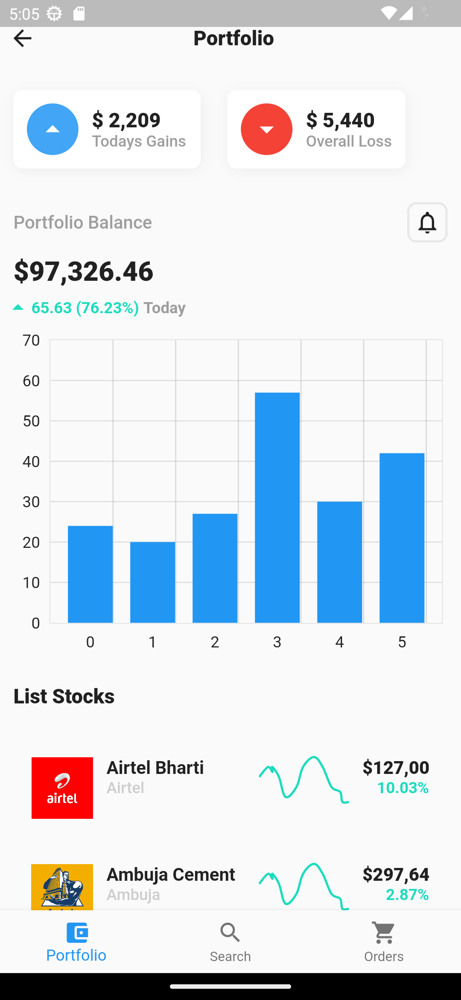
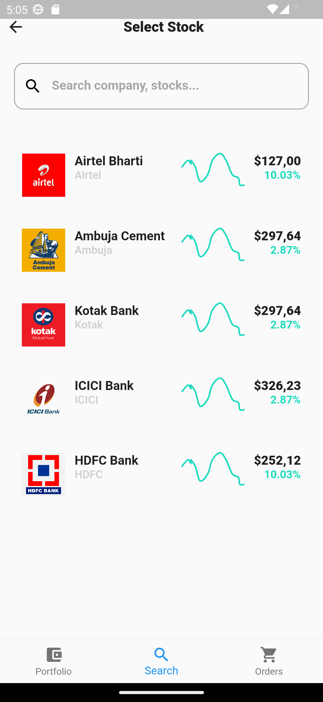
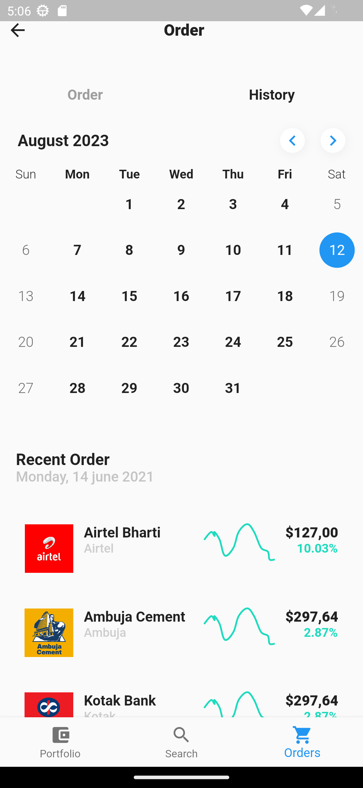

# Stock Wallet

A Flutter app demo for a stock wallet where user can search add and monitor stocks.

## Table of Contents

- [Description](#description)
- [Features](#features)
- [Installation](#installation)
- [Screenshots](#screenshots)
- [Source Code](#Source-code)

## Description

This Flutter app showcases a customized stock wallet application, includes portfolio, orders and a catalog to search from.

## Features

- **Portfolio Management:** Keep track of owned stocks and their performance.
- **Order Tracking:** Monitor open, pending, and completed orders.
- **Stock Catalog:** Browse and search for available stocks to add to the portfolio.

## Installation

1. Make sure you have Flutter installed. If not, follow the [Flutter installation guide]().

## Screenshots

  

## Source-code
2. Clone this repository:

   ```bash
   git clone 